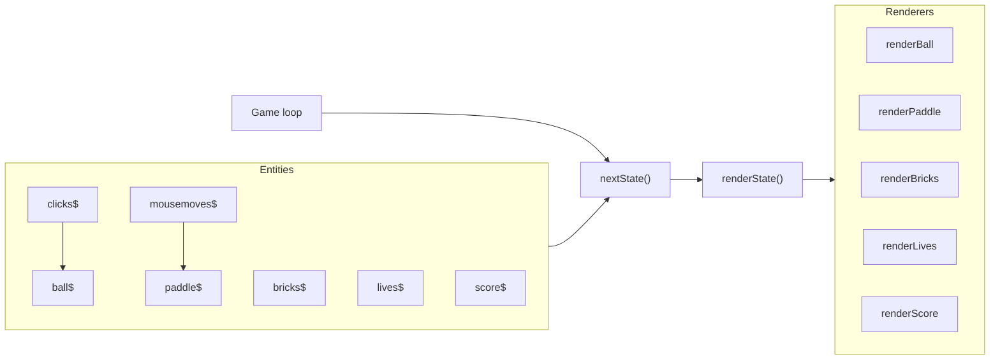
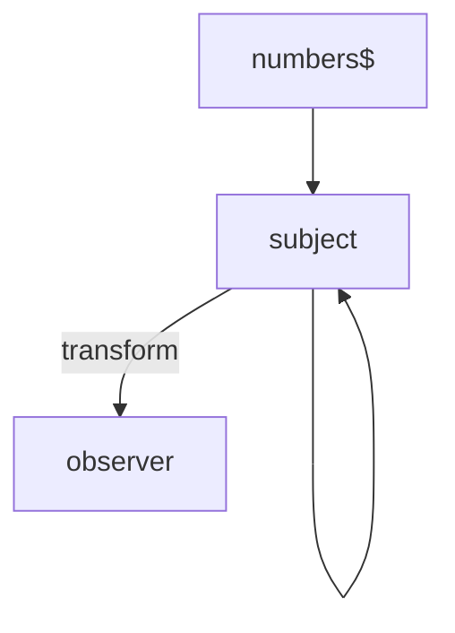
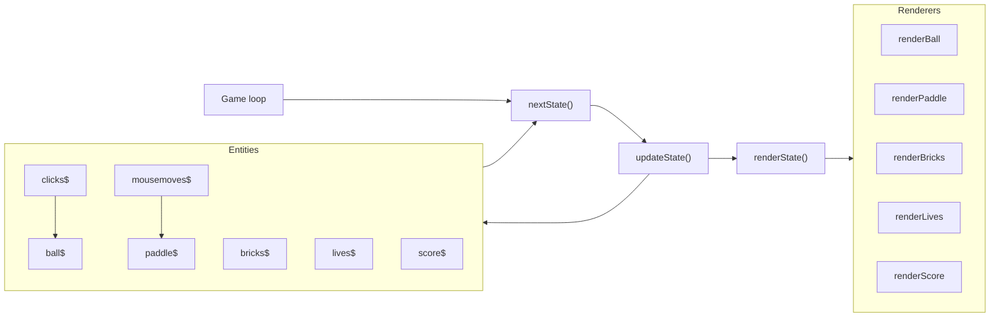

<div class="text-center">
  
  <h1>RxJS fundamentals</h1>
</div>

---
layout: quote
---

# [Reactive Extensions](https://reactivex.io/)

<div class="text-xl italic my-8 font-serif">ReactiveX is a combination of the best ideas from the <a href="https://codepumpkin.com/wp-content/uploads/2017/11/ObserverDesignPattern.jpg" target="_blank">Observer</a> pattern, the Iterator pattern, and functional programming.</div>

<v-clicks>

- An implementation of [reactive programming](https://en.wikipedia.org/wiki/Reactive_programming)
- Created by Microsoft in 2011 for the .NET framework ([Rx.NET](https://github.com/dotnet/reactive))
- Open sourced in 2012
- **RxJS** was first released in 2013 (?)
- Shipped with Angular since 2015
- Implemented for many [languages and frameworks](https://reactivex.io/languages.html)

</v-clicks>

---

<h1 class="!mb-13">Promises vs Observables</h1>

<div class="grid grid-cols-2">
  <div>
    <h2 v-click class="mb-5">Promises…</h2>
    <ul>
      <li v-click>only resolve once</li>
      <li v-click>cannot be canceled</li>
      <li v-click>are always asynchronous</li>
      <li v-click>execute on creation (eager).</li>
    </ul>
  </div>

  <div>
    <h2 v-click class="mb-5">Observables…</h2>
    <ul>
      <li v-click>handle any number of events</li>
      <li v-click>can be canceled</li>
      <li v-click>can be synchronous or asynchronous</li>
      <li v-click>execute when subscribed (lazy).</li>
    </ul>
  </div>
</div>

---

<h1 class="!mb-8">Observable comparisons</h1>

<div class="grid grid-cols-2 gap-2">
  <v-click>

```js {} {maxHeight:'1'}


Promise
  .resolve(1)
  .then((value) => {
    console.log(value)
  })


```

</v-click>
<v-click>

```js {} {maxHeight:'1'}
import { of, tap } from 'rxjs'

of(1)
  .pipe(
    tap((value) => {
      console.log(value)
    })
  )
  .subscribe()
```

  </v-click>
  <v-click>

```js {} {maxHeight:'1'}


[1, 2, 3]
  .map((n) => n * 2)
  .filter((n) => n < 5)
  .reduce((acc, n) => acc + n, 0)


```

  </v-click>
  <v-click>

```js {} {maxHeight:'1'}
import { from, map, filter, reduce } from 'rxjs'

from([1, 2, 3])
  .pipe(
    map((n) => n * 2),
    filter((n) => n < 5),
    reduce((acc, n) => acc + n, 0)
  )
  .subscribe()
```

  </v-click>
</div>

---

<h1 class="!mb-13">Observable anatomy</h1>

```js {1-3|1,4-8|1,9|1,11-12|all}
import { of, map, filter } from 'rxjs'

const subscription = of()   // a "creation" function
  .pipe(
    map(),                  // operators
    filter(),
    // …
  )
  .subscribe()              // nothing happens until this is called

// later:
subscription.unsubscribe()  // clean up to prevent memory leaks
```

<!-- `subscription` is **not** an observable! -->

---

<h1 class="!mb-8">The observer</h1>

```js {1-3,13|1-6,13,15|1-6,13,15-16|1-6,13,15-17|1-3,7-9,13,18|1-3,10-13|all}
import { of } from 'rxjs'

of(1, 2, 3).subscribe({     // subscribe() accepts an observer
  next: (n) => {            // next() is called for each value
    console.log('Next:', n)
  },
  complete: () => {         // complete() is called without arguments
    console.log('Done!')
  },
  error: (err) => {         // in case of an error
    console.error(err)
  }
})

// Next: 1
// Next: 2
// Next: 3
// Done!
```

<!-- Where an observable is a <strong>producer</strong> of values, an observer is a <strong>consumer</strong> of values. -->

---

<h1>Combining observables</h1>

<div class="grid grid-cols-7 gap-6">
  <div class="col-span-6">

```js {1-4|1-8|1-4,10-12|1-4,14-16|1-4,18-22|all}
import { fromEvent, interval, merge, combineLatest, zip, withLatestFrom } from 'rxjs'

const clicks$ = fromEvent(document, 'click')
const seconds$ = interval(1000)

merge(clicks$, seconds$).subscribe((clickOrSecond) => {
  console.log(clickOrSecond) // either a click or an interval
})

combineLatest([clicks$, seconds$]).subscribe(([latestClick, latestSecond]) => {
  console.log(latestClick, latestSecond) // latest click and second when either emits
})

zip(clicks$, seconds$).subscribe(([latestClick, latestSecond]) => {
  console.log(latestClick, latestSecond) // latest click and second when both have emitted
})

clicks$
  .pipe(withLatestFrom(seconds$))
  .subscribe(([latestClick, latestSecond]) => {
    console.log(latestClick, latestSecond) // latest click and latest second for each click
  })
```

  </div>
  <div class="text-sm flex flex-col justify-around items-start pt-16 pb-8">
    <a href="https://rxjs.dev/api/index/function/merge#description" target="_blank">merge()</a>
    <a href="https://rxjs.dev/api/index/function/combineLatest#description" target="_blank">combineLatest()</a>
    <a href="https://rxjs.dev/api/index/function/zip" target="_blank">zip()</a>
    <a href="https://rxjs.dev/api/index/function/withLatestFrom#description" target="_blank">withLatestFrom()</a>
  </div>
</div>

---

<h1 class="!mb-5">Game architecture (first attempt)</h1>



---

<h1 class="!mb-8">Subjects</h1>

<div class="grid grid-cols-2 gap-2 mb-8">
  <div>
    <div class="mb-3 leading-snug text-[1rem]">Consider the relation between <em>observable</em> and <em>observer</em>:</div>

```js{0|1-7|1-11|all}
import { Observable } from 'rxjs'

// same as: `of('Hello')`
const observable$ = new Observable((observer) => {
  observer.next('Hello')
  observer.complete()
})
const observer = {
  next:     (value) => console.log(value),
  complete: () =>      console.log('Done!'),
}

observable$.subscribe(observer)


// Hello

// Done!
```

  </div>
  <div v-click>
    <div class="mb-3 leading-snug text-[1rem]">A Subject is an observable <em>and</em> an observer:</div>

```js
import { Subject } from 'rxjs'


const subject = new Subject()


const observer = {
  next:     (value) => console.log(value),
  complete: () =>      console.log('Done!'),
}

subject.subscribe(observer)

subject.next('Hello')
// Hello
subject.complete()
// Done!
```

  </div>
</div>

<!-- A subject is an Observable that also has the methods of an Observer. -->

---

<h1 class="!mb-13">Subject as an observer</h1>

<div class="grid grid-cols-4 gap-2">
  <div class="col-span-3">

```js{1-5|1-9|1-11|1-16|all}
import { Subject, map, of } from 'rxjs'

const subject = new Subject()
const transform = map(value => value * 2)
const observer = (value) => console.log(value)

subject
  .pipe(transform)
  .subscribe(observer)

const numbers$ = of(1, 2, 3)

numbers$.subscribe(subject)
// 2
// 4
// 6

subject.next(4)
// 8
```

  </div>
  <div v-click class="text-center">



  </div>
</div>

<!-- Passing a function to `subscribe()` is the same as only passing `next`. -->

---

<h1 class="!mb-8">Behavior subjects</h1>

<div class="mb-3">A Subject with a "current value". Ideal for reading/writing state.</div>

```js{0|1-3|1-6|1-8|1-11|1-14|all}
import { BehaviorSubject } from 'rxjs'

const state = new BehaviorSubject(0)

state.subscribe(value => console.log(`A: ${value}`))
// A: 0
state.next(1)
// A: 1

state.subscribe(value => console.log(`B: ${value}`))
// B: 1
state.next(2)
// A: 2
// B: 2

state.value
// 2
```

<!--
- You must pass initial the state
- A "late" observer receives the current value immediately
- Only BehaviorSubjects have the `value` property
-->

---

<h1 class="!mb-5">Game architecture (with BehaviorSubjects)</h1>


